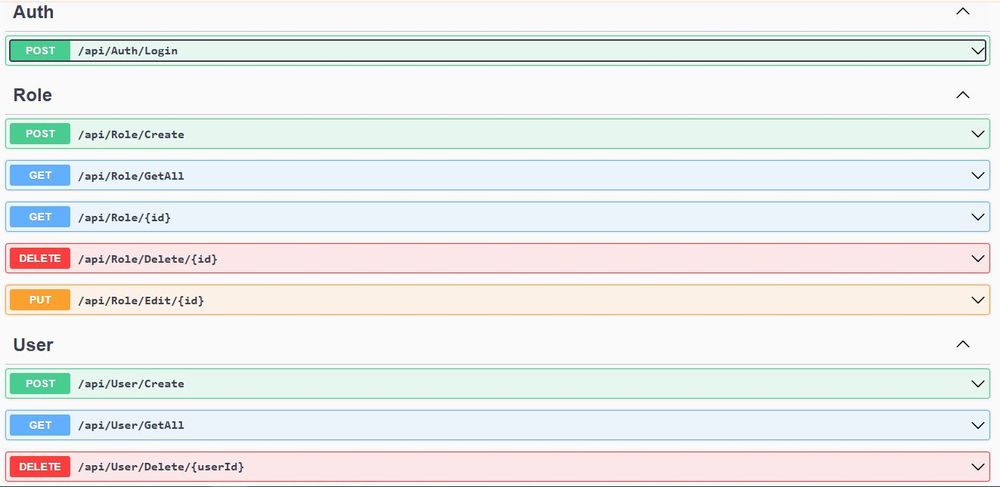

# Enterprise Applications whith ASP.NET Core Clean Architecture and CQRS
  This project was designed to simplify the initial development of a business management 
  application by providing the essential modules needed. It adopts a scalable, low-latency 
  architecture, utilizing the most advanced and modern technologies available.

[](https://skillicons.dev)



## How to Run the Project
1. Clone the repository.
2. Open the solution in Visual Studio 2022.
3. Configure your SQL Server connection in the appsettings.json file.
4. Run the database migrations to create the necessary tables.
   - Check if the .NET Entity Framework CLI is installed.
   - The first step is to verify that the Entity Framework CLI is installed correctly. Run the following command:

```
 dotnet tool list -g
```

   - If dotnet-ef is not listed, install with the following command:

```
dotnet tool install --global dotnet-ef
```

   - After installing the package, run the following command:

```
dotnet ef database update -p Enterprise.Applications.Identity.Infra -s Enterprise.Applications.Identity.API -c ApplicationDbContext`
```

5. Build and run the ASP.NET Core Web API.


## Project Features ASP.NET Core Web API.
1. Identity Administration
   - Role
     - [x] Create
     - [x] GetAll
     - [x] Get/{id}
     - [x] Delete/{id}
   - User
     - [x] Create
     - [x] GetAll
     - [x] Delete/{userId}
     - [x] GetUserDetails/{userId}
     - [x] GetUserDetailsByUserName/{userName}
     - [x] User - AssignRoles
     - [x] EditUserRoles
     - [x] GetAllUserDetails
     - [x] EditUserProfile/{id}
   Auth
     - [x] Login
     - [ ] Logout
     - [ ] RememberPassword 


## Project Structure
- **back-end**: Contains the source code for the ASP.NET Core Web API.
- **front-end**: Contains the source code for the Angular project..
- **tests**: Contains unit tests for the project.

## Technologies Used
- ASP.NET Core 8.0
- C#
- Clean Architecture
- CQRS Pattern
- Identity (Role and User Management)
- SQL Server
- Dapper
- Entity Framework
- AutoMapper
- MediatR
- JWT Authentication and Authorization

## Additional Notes
- Make sure to secure sensitive information such as connection strings and secret keys.
- Customize the project according to your specific requirements.

Feel free to contribute, report issues, or provide feedback!

